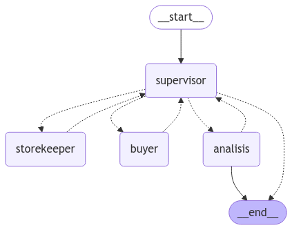

# Proyecto de Desarrollo de Aplicaciones en LangChain

**Autor**: Elias Gregorio Pena Evertz  
**Rol**: Data Engineer  
**Experiencia**: Más de 12 años en inteligencia de negocios.  
**Programa**: AI Engineer de Datapath  
**Tarea**: Módulo 3 - Desarrollo de Aplicaciones en LangChain  
**LinkedIn**: [https://www.linkedin.com/in/egregoryp/](https://www.linkedin.com/in/egregoryp/)
**Instructor**: Joel Espinoza 

---

## Descripción del Proyecto

Este proyecto tiene como objetivo implementar un sistema basado en **LangChain** que permita analizar datos de ventas mediante herramientas personalizadas y generación de gráficos para respaldar la toma de decisiones estratégicas. La solución integra un flujo de trabajo definido en un grafo, herramientas específicas para la manipulación de datos, y endpoints de una API desarrollada en **FastAPI** para interactuar con el sistema.

---

## Arquitectura General

El proyecto se basa en los siguientes componentes principales:

1. **Estructura del Grafo**:
   - Representado en la imagen generada `graph_image.png`, el flujo incluye los nodos:
     - `__start__`: Inicio del flujo.
     - `supervisor`: Nodo central encargado de supervisar las operaciones.
     - `storekeeper`: Nodo que gestiona inventarios.
     - `buyer`: Nodo que analiza datos de compras.
     - `analisis`: Nodo que realiza análisis avanzado de los datos de ventas.
     - `__end__`: Finalización del flujo.
   - Este grafo asegura que las tareas fluyen correctamente entre los nodos para generar los resultados esperados.
     - Diagrama del Flujo del Grafo. El siguiente diagrama representa el flujo del grafo utilizado en el proyecto:
       


2. **Herramientas (Tools)**:
   - **`get_all_purchases`**: Recupera todos los datos de ventas almacenados en una base de datos SQLite (`inventory.db`).
   - **`tavily_tool`**: Realiza análisis avanzados sobre los datos, detectando patrones y proporcionando recomendaciones más profundas.

3. **FastAPI**:
   - Provee una interfaz interactiva a través de Swagger UI para consumir el sistema.
   - Endpoints principales:
     - `/`: Retorna un mensaje de bienvenida.
     - `/agente`: Endpoint principal que recibe preguntas y devuelve análisis y recomendaciones basadas en los datos.

4. **Plantilla del Prompt (LangChain)**:
   - Define la interacción del modelo con las herramientas. La plantilla instruye al agente a:
     - Realizar análisis estadístico.
     - Generar insights clave.
     - Proporcionar recomendaciones claras y accionables.
   - Integra las herramientas `get_all_purchases` y `tavily_tool`.

5. **Visualización y Resultados**:
   - La estructura del grafo se representa visualmente para entender el flujo de tareas.
   - Los resultados del análisis incluyen un resumen general, insights detallados y recomendaciones específicas.

---

## Funcionalidades del Proyecto

- **Análisis de Datos de Ventas**:
  - El agente utiliza `get_all_purchases` para recuperar datos y realiza un análisis inicial.
  - `tavily_tool` amplía el análisis con insights avanzados.

- **Generación de Reportes**:
  - El sistema genera reportes con:
    - Resumen general del desempeño de ventas.
    - Insights detallados sobre productos, categorías y regiones.
    - Recomendaciones basadas en los datos analizados.

- **Interfaz Interactiva**:
  - Los endpoints de FastAPI permiten a los usuarios interactuar con el sistema y recibir respuestas en formato estructurado.

---

## Tecnologías Utilizadas

1. **LangChain**:
   - Framework para la integración de herramientas personalizadas con modelos de lenguaje.
2. **FastAPI**:
   - Framework de Python para construir APIs rápidas y escalables.
3. **SQLite**:
   - Base de datos utilizada para almacenar datos de compras.
4. **Python**:
   - Lenguaje principal para el desarrollo de la solución.
5. **Swagger UI**:
   - Documentación interactiva para probar los endpoints de la API.

---

## Estructura del Proyecto

```plaintext
src/
├── agent/
│   ├── __init__.py
│   ├── agente_analisis.py    # Implementación del agente basado en LangChain
├── data/
│   ├── inventory.db          # Base de datos SQLite
├── graph/
│   ├── graph.py              # Implementación del grafo de nodos
├── models/
│   ├── model.py              # Configuración del modelo de lenguaje
├── node/
│   ├── supervisor_node.py    # Nodo de supervisión
│   ├── storekeeper_node.py   # Nodo de inventarios
│   ├── buyer_node.py         # Nodo de compras
│   ├── analisis_node.py      # Nodo de análisis avanzado
├── prompts/
│   ├── templates.py          # Plantilla del prompt LangChain
├── tools/
│   ├── fake_api.py           # Herramienta para recuperar datos de compras
│   ├── tavily_tool.py        # Herramienta de análisis avanzado
├── utils/
│   ├── make_system_prompt.py # Utilidad para generar prompts dinámicos
│   ├── functions.py
```

## Resultados Clave

### Resumen General:
- Identifica ingresos totales y productos más vendidos.
- Muestra el desempeño general de ventas en términos cuantitativos y financieros.

### Análisis Detallado:
- Describe tendencias de ventas, como los productos más vendidos y los de menor rendimiento.
- Identifica patrones clave que pueden influir en las decisiones estratégicas.

### Recomendaciones:
- Proporciona acciones claras y específicas para:
  - Aumentar las ventas de productos con bajo rendimiento.
  - Reponer inventarios de productos con alta demanda.
  - Explorar nuevas estrategias de marketing o segmentación regional.

---

## Cómo Ejecutar el Proyecto

### Clona el repositorio:
```bash
git clone <repositorio>
cd <directorio>
pip install -r requirements.txt
uvicorn main:app --reload
```

### Luego de instalar, Accede a la API:
- **Swagger UI**: [http://127.0.0.1:8000/docs](http://127.0.0.1:8000/docs)
- **ReDoc**: [http://127.0.0.1:8000/redoc](http://127.0.0.1:8000/redoc)

---

## Conclusión

Este proyecto demuestra la capacidad de integrar herramientas personalizadas con un modelo de lenguaje para realizar análisis de datos avanzados, proporcionando resultados útiles y prácticos para la toma de decisiones estratégicas.

**Conecta conmigo en LinkedIn**: [https://www.linkedin.com/in/egregoryp/](https://www.linkedin.com/in/egregoryp/)

¡No dudes en contribuir o sugerir mejoras!
